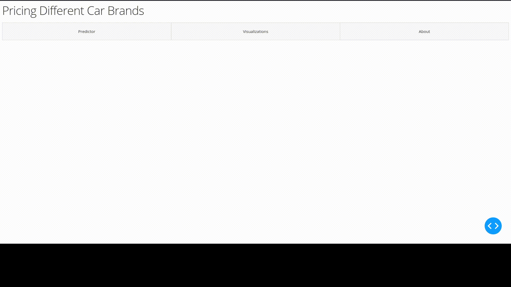

# Car Price Predictor Dash App

In this project I wanted to create a [shiny](https://shiny.rstudio.com/) like app in python use [Plotly Dash](https://plotly.com/dash/).

The end goal is to have a lightweight web app where you can explore and visualize datasets from the famous [cars dataset](https://www.kaggle.com/adityadesai13/used-car-dataset-ford-and-mercedes) 
as well as use some pre-trained `sklearn` models to predict the price of a hypothetical car.

# Showcase  

## Prediction

## Visualization

# Usage

1. Clone the repository to your local machine

`git clone https://github.com/Khanzi/CarPricePredictorDashApp.git`

2. Run `app.py`

`python3 app.py`

3. Visit the app in your local browser at

`http://127.0.0.1:8050/`

**Note**
if it fails to run make sure the dependencies are installed.

`pip install <package>`

### Known Issues

* [ ] Once a prediction is made for a given brand in the prediction tab then subsequent predictions are unable without refreshing the page.
  * This is likely due to a referential error when encoding the data for the prediction.
  * Possible fix is the to trim the end off the dataset (which contains user input data) and then reverse encode the dataset to set it back to a normal state.
  
